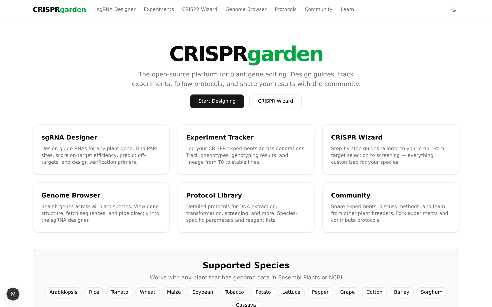
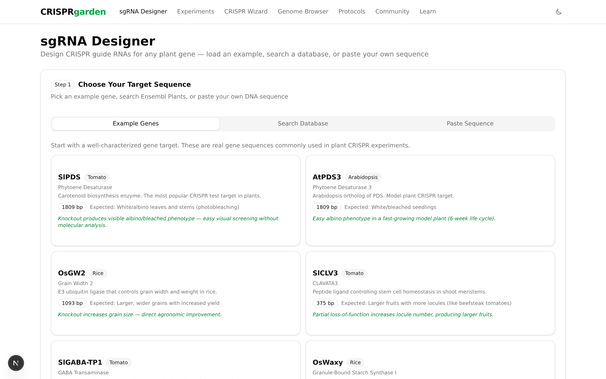
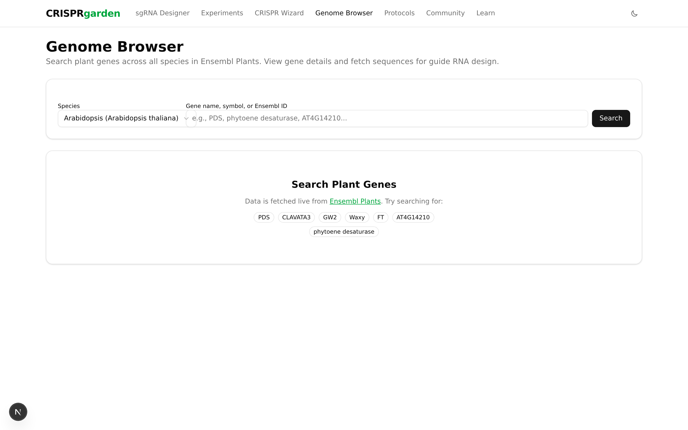
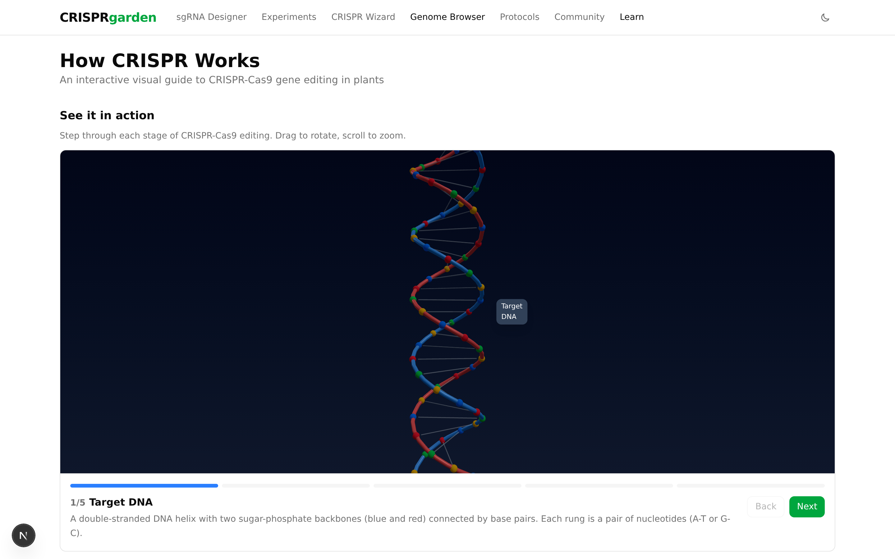
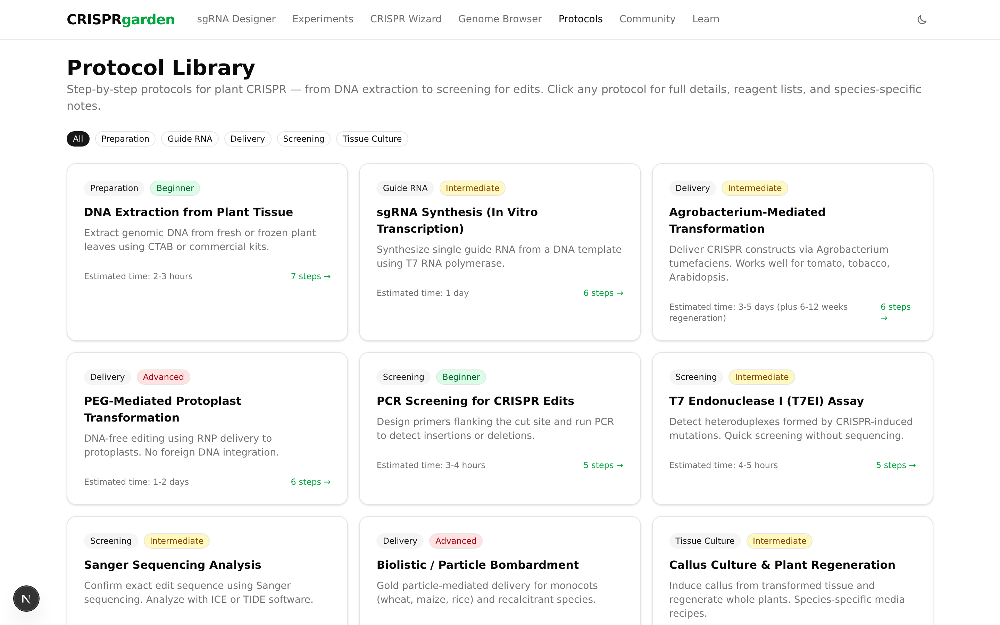
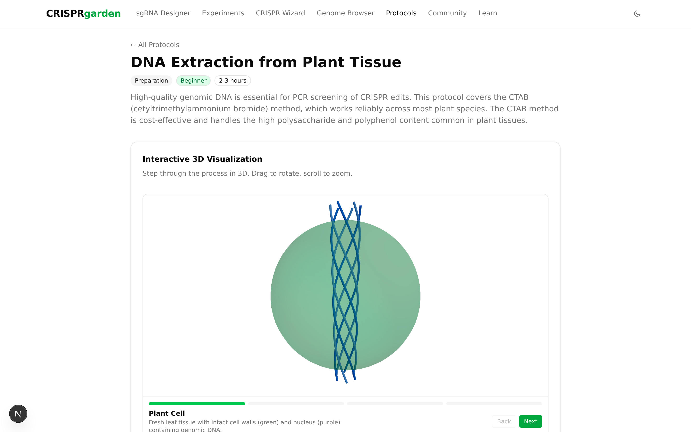
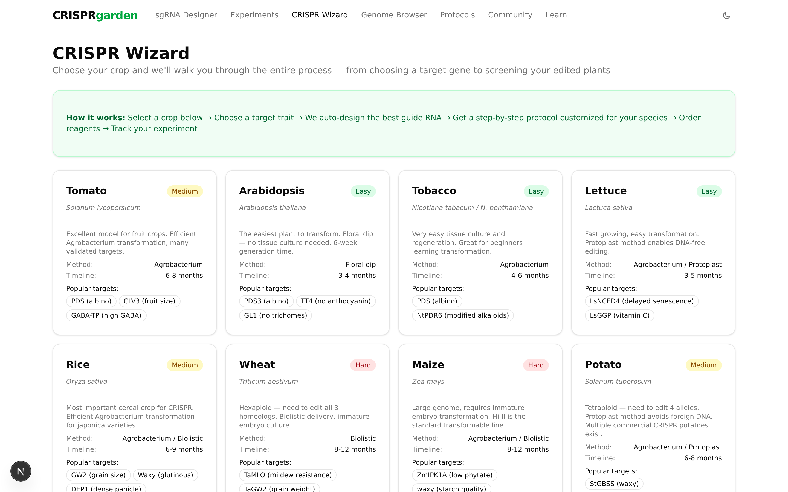
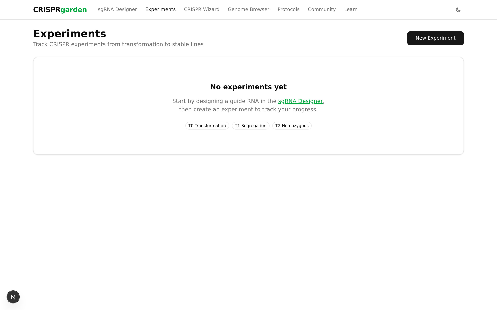
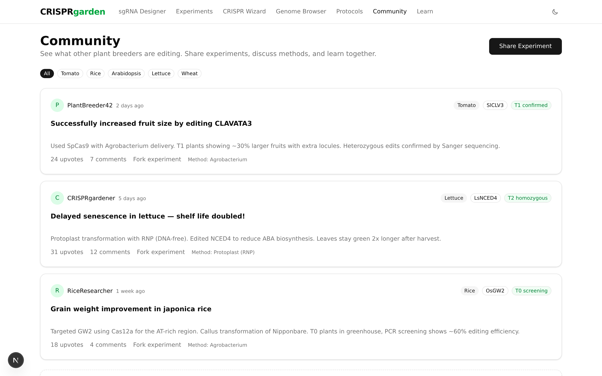

# CRISPRgarden

Open-source platform for plant gene editing. Design guide RNAs, track experiments, follow protocols, and share results with the community.



## Features

### sgRNA Designer
Design CRISPR guide RNAs for any plant gene. Supports SpCas9, Cas12a/Cpf1, and 4 other Cas proteins. On-target scoring, off-target analysis (MIT + CFD), primer design, and interactive visualizations.



### Genome Browser
Search genes across all plant species via Ensembl Plants. Fetch coding sequences and pipe directly into the guide designer.



### Learn How CRISPR Works
Interactive 3D step-through of the CRISPR-Cas9 mechanism — from PAM recognition to double-strand break and repair.



### Protocol Library
9 detailed protocols with step-by-step instructions, reagent lists, species-specific notes, troubleshooting, and interactive 3D visualizations for each technique.




### CRISPR Wizard
Crop-specific step-by-step guides. Select your plant, pick a target gene, choose a delivery method, get media recipes, and order reagents.



### Experiment Tracker
Log CRISPR experiments across generations. Track phenotypes, genotyping results, and zygosity.



### Community
Share experiments, discuss methods, and learn from other plant breeders.



## Supported Species

Arabidopsis, Rice, Tomato, Wheat, Maize, Soybean, Tobacco, Potato, Lettuce, Pepper, Grape, Barley, Sorghum, Cotton, Cassava — and any plant with genome data in Ensembl Plants.

## Tech Stack

- **Frontend**: Next.js 15 (App Router), TypeScript, Tailwind CSS, shadcn/ui
- **3D**: Three.js / React Three Fiber / Drei
- **API**: Hono (inside Next.js API routes, extractable for standalone/mobile)
- **Database**: PostgreSQL + Drizzle ORM
- **Genome data**: Ensembl Plants REST API
- **Bioinformatics**: Custom TypeScript — PAM scanning, on-target scoring, off-target analysis (MIT/CFD), primer design, Tm calculation

## Getting Started

```bash
git clone https://github.com/jakobrichert/crisprgarden.git
cd crisprgarden
npm install
npm run dev
```

Open [http://localhost:3000](http://localhost:3000).

## API

The backend exposes a versioned REST API at `/api/v1/` designed for future mobile app consumption:

- `POST /api/v1/sgrna/design` — Design and rank guide RNAs
- `POST /api/v1/sgrna/primers` — Design verification primers
- `POST /api/v1/sgrna/offtargets` — Off-target analysis
- `GET /api/v1/genome/search` — Search genes (Ensembl Plants proxy)
- `GET /api/v1/genome/sequence` — Fetch gene sequences
- `GET /api/v1/cas-proteins` — List supported Cas proteins
- `GET /api/v1/species` — List supported species

## Bioinformatics

All core algorithms run in TypeScript with zero external dependencies:

- **PAM scanning**: IUPAC-aware regex matching on both strands
- **On-target scoring**: Position-weighted nucleotide preferences, GC content, seed Tm, self-complementarity, poly-T penalties (based on Doench 2016 / Xu 2015)
- **Off-target scoring**: MIT specificity score (Hsu 2013) + CFD score (Doench 2016) with position-specific mismatch matrices
- **Primer design**: Nearest-neighbor Tm (SantaLucia 1998), GC clamp, self-dimer filtering, Tm-matched pairing
- **Cas proteins**: SpCas9, SpCas9-HF1, eSpCas9, SpCas9-NG, Cas12a/Cpf1, Cas12b

## Roadmap

### In Progress
- [ ] Authentication (NextAuth.js — email + GitHub/Google OAuth)
- [ ] Database persistence (PostgreSQL + Drizzle ORM, replace in-memory state)

### Planned
- [ ] **Experiment tracker persistence** — save experiments to DB, photo uploads for phenotypes and gel images
- [ ] **Community features** — user profiles, public experiment feed, comments, upvotes, forking experiments
- [ ] **Discussion forums** — per-species and per-technique channels, Q&A with accepted answers
- [ ] **User-submitted protocols** — community protocol contributions with versioning and voting
- [ ] **More crop profiles** — expand wizard beyond the initial 15 species, add community-contributed profiles
- [ ] **Genome-wide off-target search** — index full plant genomes for comprehensive off-target analysis (currently local sequence only)
- [ ] **Data export** — CSV/JSON export for experiments, guides, and primer lists
- [ ] **Reference library** — curated database of published plant CRISPR studies
- [ ] **Glossary & troubleshooting guide** — searchable reference for beginners
- [ ] **Python ML sidecar** — Azimuth model (Doench 2016) for higher-accuracy on-target scoring via FastAPI
- [ ] **Mobile app** — React Native / Expo consuming the existing REST API
- [ ] **Offline mode** — local genome cache + SQLite for field use
- [ ] **Docker Compose** — one-command deployment for the full stack
- [ ] **OpenAPI docs** — auto-generated Swagger documentation for the API

### Ideas
- Multiplexed guide design (multiple targets in one construct)
- Base editing and prime editing support
- CRISPR interference (CRISPRi) / activation (CRISPRa) guide design
- Integration with Benchling, SnapGene, or other lab software
- Barcode/QR labels for plant tracking in the greenhouse
- Regulatory compliance checker (is this edit GMO or non-GMO in your jurisdiction?)

## Contributing

Contributions welcome! This is an open-source project and we'd love help from plant scientists, bioinformaticians, and developers.

1. Fork the repo
2. Create a feature branch (`git checkout -b feature/my-feature`)
3. Commit your changes
4. Push to the branch and open a PR

## License

MIT
